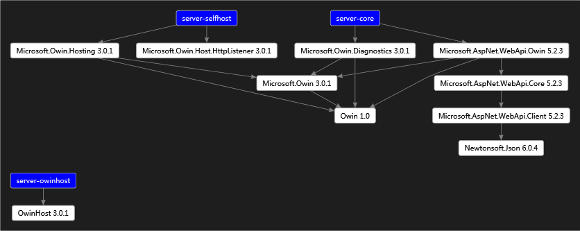

# Readme

## Package Reference Diagram


## Notice
I met a problem when running this project, server-core.dll are referenced to Microsoft.Owin.dll with v3.0.1, but System.Web.Http.Owin.dll v5.2.3 referenced Microsoft.Owin.dll v2.0.2, this will lead to a type conversion error in runtime. To fix that, we need add bindingRedirect to app's configuration file, check server-core/app.config, server-selfhost/app.config and server-owinhost/web.config files.
```xml
  <runtime>
    <assemblyBinding xmlns="urn:schemas-microsoft-com:asm.v1">
      <dependentAssembly>
        <assemblyIdentity name="Microsoft.Owin" publicKeyToken="31bf3856ad364e35" culture="neutral" />
        <bindingRedirect oldVersion="0.0.0.0-3.0.1.0" newVersion="3.0.1.0" />
      </dependentAssembly>
    </assemblyBinding>
  </runtime>
```
